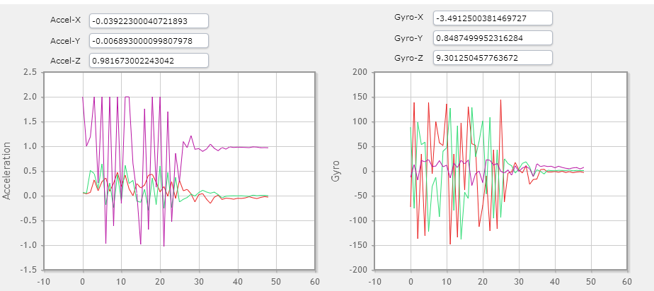
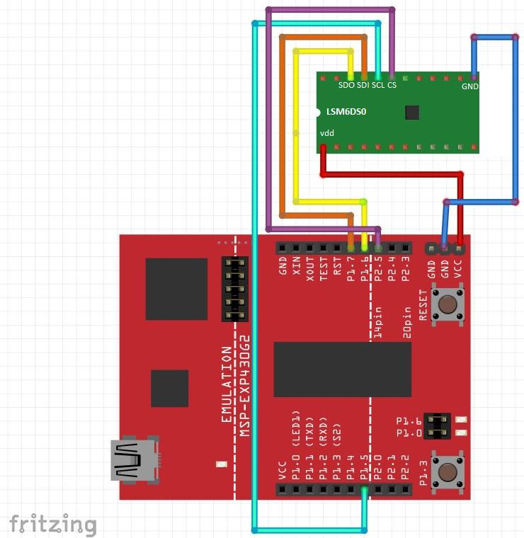

# LSM6DS0-driver-for-MSP430
Accelerometer and Gyroscope Driver for the LSM6DS0 using the MSP430. 

For more information, please see the full article:
http://mcuhq.com/edit/28/msp430-3-axis-accelerometer-and-gyroscope-example-driver-using-the-lsm6ds0ple

## Introduction

This library contains a simple API to gather the gyro and accelerometer x,y,z points using SPI. The GUI Composer tool inside of Code Composer Studio is used to graphically display the data in real-time. Here is a youtube video displaying the final output:

https://www.youtube.com/watch?v=OGfDyrtRUM8

## Required Tools

1. [STEVAL-MKI161V1 Adapter Board ](http://www.st.com/content/st_com/en/products/evaluation-tools/product-evaluation-tools/mems-motion-sensor-eval-boards/steval-mki161v1.html)
2. MSP430 launchpad
3. Code Composer Studio (CCS) and the Grace and GUI Composer plugins
4. USB mini cable to connect the launchpad to a computer running GUI Composer

## Setup

1. Connect the sensor to the launchpad

2. Clone this repo and open the project inside of CCS
3. Compile and flash the MSP430
4. Launch the GUI Composer plugin inside of CCS
5. Open the COM port and see the real-time x,y,z points being plotted

Sample usage without using Code Composer Studio:

    #include "LSM6DS0.h"

    accelLoad(&x_gyro); // get accelerometer results
    gyroLoad(&x_gyro); // get gyro results

## Issues

Please submit all issues to the github tracker. Pull requests are also encouraged. General comments can be left either inside github or at mcuhq.com

    
